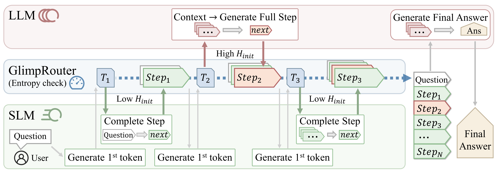

# GlimpRouter: Efficient Collaborative Inference by Glimpsing One Token of Thoughts

<a href=https://arxiv.org/abs/2601.05110></a>&nbsp;&nbsp;<a href=https://huggingface.co/papers/2601.05110></a>


---

Official implementation of **GlimpRouter: Efficient Collaborative Inference by Glimpsing One Token of Thoughts**.

|  |
|:--:|
|GlimpRouter is a lightweight, training-free step-wise routing framework that uses the entropy of the initial token in each reasoning step to decide whether a small model or a large model should generate the step.|


## Code

### Installation

1. Clone this repository:
```shell
git clone git@github.com:Zengwh02/GlimpRouter.git
cd GlimpRouter
```

2. Set up your Python environment:
```shell
conda create -n glimp_router python=3.12 -y
conda activate glimp_router
pip install -r requirements.txt
```

3. (Optional) Download datasets using the helper script:
```shell
bash setup.sh
```

### Quick Start

This project uses a simple `config.json` to pass experiment settings to `src/main.py`. You can generate a config with the provided script and then run the main entrypoint:

```shell
cd src
bash run.sh
```

The script writes `config.json` and launches `main.py` in the background, logging to `./logs/`.

### Running the vLLM Server

If you serve models locally with vLLM, fill in placeholders in `server/serve.sh` and run:

```shell
cd server
bash serve.sh
```

Notes:
- Replace `YOUR_API_KEY`, `YOUR_MODEL_NAME_OR_PATH`, `YOUR_BASE_URL`, and `YOUR_PORT` with your own values.
- Use the matching chat template from `server/template/` or provide your own.

### Key Scripts

- `src/main.py`: entrypoint for GlimpRouter experiments; loads a dataset, performs routing, and writes results.
- `src/glimprouter.py`: core implementation of GlimpRouter step-wise routing and entropy-based decision logic.
- `src/run.sh`: example runner that generates `config.json` and starts `main.py`.
- `server/serve.sh`: helper script for spinning up a vLLM server.

## Datasets

The current code supports the following datasets:
- AIME24/AIME25 (math)
- MATH-500 (math)
- GPQA (general reasoning)
- LiveCodeBench v5/v6 (code generation)

To use datasets stored locally (e.g., GPQA or LiveCodeBench), edit the placeholders in `src/main.py`:

```python
data_files="YOUR_DIRECTORY_OF_GPQA_DATASET"
data_files="YOUR_DIRECTORY_OF_LCB_DATASET"
```

For public datasets loaded via `datasets.load_dataset`, the dataset identifiers are set directly in the code. If you want to change them, update the dataset names in `src/main.py`.

## Configuration

`config.json` is read automatically by `src/main.py`. CLI arguments override config values. Example:

```json
{
  "dataset_name": "lcbv5",
  "repeat_num": 6,
  "score_method": "first_token_entropy",
  "token_budget": 8192,
  "output_dir": "./results",
  "model_size": "32b",
  "small_model_size": "4b",
  "score_threshold": 1.0
}
```

## Project Structure

```text
.
├── data/                         # Local dataset files (optional)
├── server/
│   ├── serve.sh                  # vLLM server helper script
│   └── template/                 # Chat templates for different models
├── src/
│   ├── main.py                   # Experiment entrypoint
│   ├── glimprouter.py            # GlimpRouter core logic
│   └── run.sh                    # Example runner
├── requirements.txt
└── setup.sh
```

<!-- ## Results

Please see the paper for full results. Placeholder examples:
- AIME25: +X.X% accuracy, -Y.Y% latency vs. large model baseline.
- GPQA: +X.X% accuracy, -Y.Y% latency vs. large model baseline. -->

## BibTeX

```
@misc{zeng2026glimprouterefficientcollaborativeinference,
      title={GlimpRouter: Efficient Collaborative Inference by Glimpsing One Token of Thoughts}, 
      author={Wenhao Zeng and Xuteng Zhang and Yuling Shi and Chao Hu and Yuting Chen and Beijun Shen and Xiaodong Gu},
      year={2026},
      eprint={2601.05110},
      archivePrefix={arXiv},
      primaryClass={cs.AI},
      url={https://arxiv.org/abs/2601.05110}, 
}
```

<!-- ## Acknowledgements

This repository builds on open-source inference tooling and public datasets. We thank the maintainers and the research community for their contributions. -->

<!-- ## License

License information will be added in a future update. -->